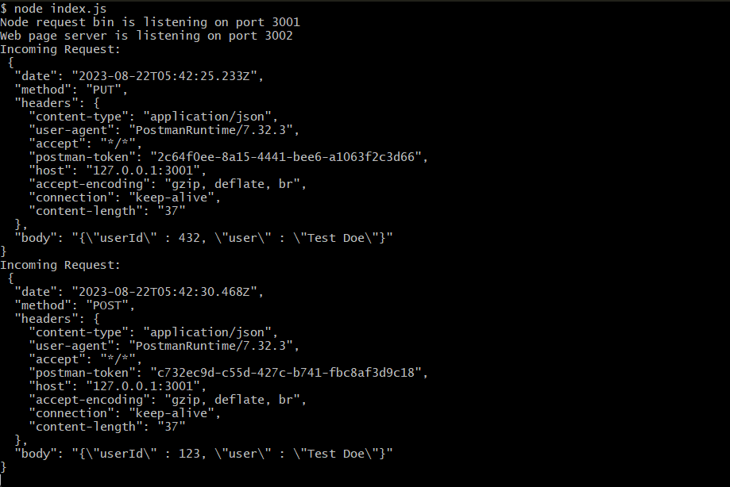

# Node Request Bin

Node Request Bin is a lightweight Node.js HTTP server that provides a simple way to log incoming HTTP requests. It captures various details of incoming requests, including the HTTP method, headers, and body, allowing you to inspect and analyze incoming traffic. This tool is particularly useful for debugging and testing webhook integrations or APIs.

## Features

- Logs incoming HTTP requests with method, headers, and body in console.
- Simpel web interface for viewing captured requests(enerate cURL commands from incoming requests).
 
## Getting Started

1. Clone (git clone https://github.com/yourusername/node-request-bin.git) or Copy index.js

2. node index.js

3. For sending request the default port is 127.0.0.1:3001 and you can view the result in the console or on the webserver 127.0.0.1:3002

### Prerequisites

Make sure you have the following software installed before setting up and running Node Request Bin:

- Node.js (>= 12.0.0) 

 ## Acknowledgements
Node Request Bin was inspired by similar tools and projects that help developers debug and inspect incoming HTTP requests.

## Contributing
Contributions are welcome! If you find a bug or have suggestions for improvements, feel free to open an issue or submit a pull request.

Fork the repository.
Create a new branch for your feature or bug fix: git checkout -b feature/your-feature-name.
Make your changes and commit them: git commit -m 'Add some feature'.
Push to the branch: git push origin feature/your-feature-name.
Open a pull request describing your changes.
